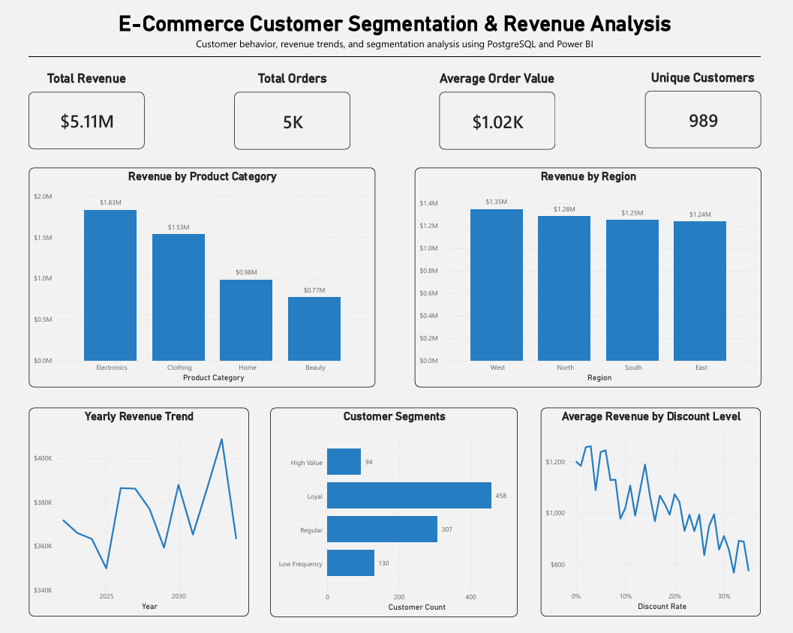

# E-Commerce Customer Segmentation & Revenue Analysis

## Tools: PostgreSQL, SQL, pgAdmin, Power BI, CTEs, Window Functions, Business Analytics

In this project, I analyzed customer behavior, revenue performance, and purchasing patterns using a synthetic e-commerce dataset containing 5,000 orders from 989 customers across multiple product categories and regions. I used PostgreSQL for the analysis and Power BI to build a dashboard summarizing the main business findings.

## Dashboard

## Key Steps:

Dataset Preparation: Loaded the e-commerce transaction dataset into PostgreSQL, defined the table schema, and checked the data for row count, date range, and missing values. The dataset contained 5,000 complete records spanning 2022–2035.

### Business Performance Analysis:

Calculated total orders, unique customers, total revenue, and average order value.

Compared revenue across product categories and regions to identify the strongest-performing areas of the business.

### Customer Behavior & Segmentation:

Analyzed customer purchase frequency, total spending, and average order value to identify the highest-value customers and compare repeat buyers with one-time customers.

Used CTEs and CASE statements to segment customers into High Value, Loyal, Regular, and Low Frequency groups based on order frequency and total spending.

### Advanced SQL Analysis:

Used the LAG() window function to calculate month-over-month revenue changes.

Applied cumulative SUM() window functions to measure customer revenue concentration and determine how much of total revenue came from the highest-spending customers.

Analyzed discount levels, delivery times, customer ratings, and order revenue to look for additional patterns in customer behavior and business performance.

### Power BI Dashboard:

Built a one-page Power BI dashboard to summarize the main findings from the analysis.

The dashboard includes total revenue, total orders, average order value, unique customers, revenue by product category and region, yearly revenue trends, customer segments, and average revenue by discount level.

### Key Takeaways:

The dataset contained 5,000 orders from 989 unique customers, generating approximately $5.11 million in total revenue with an average order value of about $1,021.96.

Customer activity was heavily repeat-driven, with 950 of 989 customers placing multiple orders and only 39 customers making a single purchase.

Customer segmentation identified 94 High Value customers who averaged approximately $10,589 in total spending and 9.33 orders, compared with Low Frequency customers who averaged about $1,691 in spending and 1.70 orders.

Revenue was relatively spread across the customer base, with approximately 58% of customers needed to generate 80% of total revenue.

The West region generated the highest total revenue at approximately $1.35 million, although revenue remained fairly balanced across all four regions.

Higher discount levels were generally associated with lower average order revenue, while average quantity purchased stayed relatively stable.

Delivery time showed little relationship with customer ratings or average order revenue in this dataset.
